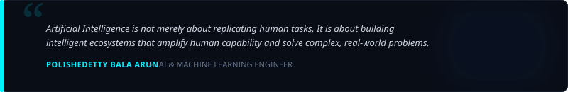

<!-- ============================================================
     Polishetty Bala Arun · GitHub Profile README
     Theme: Quantum Cyan / Cosmic Blue · Dark Mode Friendly
     ============================================================ -->

  

  
  
  
  

---

## 🌌 Core Directive & Bio

<table width="100%">
<tr>
<td width="55%" valign="top">

### ⚡ Professional Summary
Result-oriented AI/ML Engineering student specializing in deep learning, neural architectures, and retrieval systems. Experiencing in training convolutional neural networks, developing Retrieval-Augmented Generation (RAG) agents, and designing end-to-end full-stack applications. Passionate about translating complex models into deployable, production-ready AI solutions.

- 🤖 **Current Focus**: Large Language Models, RAG, and Computer Vision
- 🎓 **Education**: Pursuing B.Tech in CSE (AI & ML) at VIT AP University
- 💼 **Career Goal**: AI Engineer, pushing the boundaries of generative and predictive AI
- 💡 **Open Source**: Collaborating on deep learning & intelligent agent pipelines

</td>
<td width="45%" valign="top">

### 🎯 Key Domain Areas
* **🧠 Deep Learning & Neural Nets**
  * CNNs, sequence mapping, and classification models.
* **💬 Generative AI & Agents**
  * LangChain, multi-document RAG, vector store indexers.
* **👁️ Computer Vision**
  * Image preprocessing, OpenCV, feature enhancement.
* **☁️ Cloud & deployment**
  * AWS cloud architecting, serverless hosting, databases.

</td>
</tr>
</table>

---

## 🎓 Education Timeline

  

---

## 🛠️ Technological Arsenal

### 💻 Programming Languages

  
  
  
  
  

### 🧠 Artificial Intelligence & Machine Learning

  
  
  
  

### 📚 Frameworks & Libraries

  
  
  
  
  
  
  
  
  

### 🛢️ Databases & Cloud Systems

  
  
  
  

### 🛠️ Developer Tools & IDEs

  
  
  
  
  
  
  

---

## 🛠️ Featured AI & Engineering Projects

<table width="100%">
<tr>
<td width="50%" valign="top">

### 🩺 Skin Disease Detection System
*Deep Learning dermatology assistant for multi-class classification.*
- **Key Features**:
  - TensorFlow-based Convolutional Neural Network (CNN).
  - Advanced image preprocessing and resizing using OpenCV.
  - Asynchronous inference pipeline through Flask backend and React UI.
- **Tech Stack**: `TensorFlow` `Keras` `OpenCV` `Flask` `React`
- [📁 View Code Repository](https://github.com/PolishettyBalaArun/Skin-disease-Prediction)

</td>
<td width="50%" valign="top">

### 🧬 AI Drug Discovery (DTI Prediction)
*Deep learning framework matching proteins and candidate drugs.*
- **Key Features**:
  - CNN mapping protein sequences and molecular SMILES.
  - Explainable AI (XAI) feature attributing prediction contributions.
  - Interactive evaluation dashboard using Plotly.
- **Tech Stack**: `PyTorch` `TensorFlow` `React` `Plotly` `Flask`
- [📁 View Repository](https://github.com/PolishettyBalaArun)

</td>
</tr>
</table>

<table width="100%">
<tr>
<td width="100%" valign="top">

### 💬 Multi-PDF Retrieval-Augmented Generation (RAG)
*Enterprise document semantic search and context-aware Q&A agent.*
- **Key Features**:
  - PyPDFLoader document parser with Recursive Character Text Splitting.
  - Dense vector indexing utilizing Hugging Face Sentence Transformers and FAISS.
  - Zephyr-7B LLM orchestration via LangChain to eliminate response hallucinations.
- **Tech Stack**: `LangChain` `FAISS` `Zephyr-7B` `Streamlit` `Sentence Transformers`
- [📁 View Repository](https://github.com/PolishettyBalaArun)

</td>
</tr>
</table>

---

## 🏅 Professional Certifications

<table width="100%">
<tr>
<td align="center" width="20%">
   
  OCI Generative AI 2025 Professional
</td>
<td align="center" width="20%">
   
  OCI AI Foundations 2025 Associate
</td>
<td align="center" width="20%">
   
  AWS Cloud Architecting Graduate
</td>
<td align="center" width="20%">
   
  AWS Cloud Foundations Graduate
</td>
<td align="center" width="20%">
   
  SQL &amp; Relational Databases 101
</td>
</tr>
</table>

---

## 📊 Analytics & Activity

<table width="100%">
<tr>
<td width="50%" align="center">
  
</td>
<td width="50%" align="center">
  
</td>
</tr>
<tr>
<td width="50%" align="center">
  
</td>
<td width="50%" align="center">
  
</td>
</tr>
</table>

### 🐍 Contribution Activity Snake

  <picture>
    <source media="(prefers-color-scheme: dark)" srcset="https://raw.githubusercontent.com/PolishettyBalaArun/PolishettyBalaArun/output/github-snake-dark.svg"/>
    <source media="(prefers-color-scheme: light)" srcset="https://raw.githubusercontent.com/PolishettyBalaArun/PolishettyBalaArun/output/github-snake.svg"/>
    
  </picture>

---

## 💬 Connect With Me

<table width="100%">
<tr>
<td align="center" width="25%">
   
  polishetty-bala-arun
</td>
<td align="center" width="25%">
   
  PolishettyBalaArun
</td>
<td align="center" width="25%">
   
  balaarun203@gmail.com
</td>
<td align="center" width="25%">
   
  arun.polishetty
</td>
</tr>
</table>

---

  

  

  

